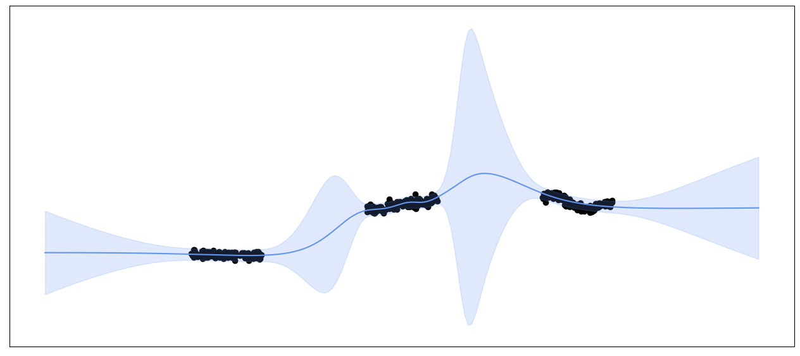

# Variational Linearized Laplace Approximation for Bayesian Deep Learning

The Linearized Laplace Approximation (LLA) has been recently used to perform uncertainty estimation on the predictions of pre-trained deep neural networks (DNNs). However, due to its large computational cost (cubic in the number of training points or DNN parameters), LLA commonly relies on additional approximations, such as Kronecker-factored or diagonal approximate GGN matrices, which can deteriorate its performance. To address these issues, we propose a new method for approximating LLA using a variational sparse Gaussian Process (GP). Our method is based on the dual RKHS formulation of GPs and retains, as the predictive mean, the output of the original DNN. Furthermore, it allows for efficient stochastic optimization, which results in sub-linear training time in the size of the training dataset. Specifically, its training cost is independent of the number of training points. Several experiments on regression and classification datasets show that our proposed method outperforms already existing efficient variants of LLA, both in terms of the quality of the predictive distribution and in terms of total computational time. The techniques we compare results with include the accelerated LLA (ELLA), based on the Nyström approximation, and other LLA variants based on the sample-then-optimize principle.

LLA  |  VaLLA | ELLA
:-------------------------:|:-------------------------:|:-:|
  |   | 
Last-Layer LLA  | Diagonal LLA | Kronecker ELLA
  |   | 

## Requirements

The used version of Python was [](https://www.python.org/downloads/release/python-31010/) with 
 [](https://pytorch.org/get-started/previous-versions/). The latter is required by the use of Backpack for automatic differentiation to compute the jacobians.

To create an environment and reproduce the experiments perform the following actions:
1. Create environment as `python -m venv .venv`
2. Activate environment as `source .venv/bin/activate`
3. Update pip as `pip install --upgrade pip`
4. Install requirements as `pip install -r requirements.txt`

> [!NOTE]  
> [](https://pytorch.org/get-started/previous-versions/) can be used if BackPack is not loaded.

## Folder Structure

The repository is structured in folders as:

    .
    ├── data                    # Contains used datasets (default download folder)
    ├── demos                   # Jupyter Notebooks for synthetic experiments
    │   ├── plots               # Stores the plots form the notebooks
    │   ├── synthetic.ipynb     # Notebook for Figure 1
    │   ├── validation.ipynb    # Notebook for Figure 6    
    │   └── increase_M.ipynb    # Notebook for Figure 7    
    ├── results                 # Obtained results in .csv format
    │   └─ *.csv
    ├── scripts                 # Python scripts for experiments
    │   ├── regression      
    │   │   └─ *.py  
    │   ├── multiclass
    │   │   └─ *.py  
    │   └── multiclass_resnet
    │   │   └─ *.py  
    ├── src                     # VaLLA and ELLA classes definition
    │   ├─ valla.py
    │   ├─ ella.py
    │   └─ utils.py
    ├── utils                   # Datasets, Models, Metrics and Torch Misc
    ├── weights                 # MAP solution weights for used models  
    ├── LICENSE
    ├── README.md
    └── requirements.txt

> [!Important]  
> Only Synthetic and Airline datasets are in the `data` folder by default as they can be difficult to obtain. The rest automatically download in the folder when needed.


## Experiments reproducibility


### Regression


```python
python ./scripts/regression/map.py --verbose --dataset Year --net_structure 200 200 200 --MAP_iterations 20000
--iterations 40000 --split 0 --weight_decay 0.01 --bb_alpha 1 --seed 0 --dtype float64 --MAP_lr 0.01
```

```python
python ./scripts/regression/lla.py --subset last_layer --hessian full --verbose --dataset Year
--net_structure 200 200 200 --MAP_iterations 20000 --iterations 40000 --split 0 --weight_decay 0.01
--bb_alpha 1 --seed 0 --dtype float64 --MAP_lr 0.01
```


```python
python ./scripts/regression/ella.py --verbose --dataset Year --net_structure 200 200 200
--MAP_iterations 20000 --iterations 40000 --split 0 --num_inducing 2000 --weight_decay 0.01
--bb_alpha 1 --prior_std 1 --ll_log_va -5 --seed 0 --MAP_lr 0.01
```

```python
python ./scripts/regression/valla.py --verbose --dataset Year --net_structure 200 200 200
--MAP_iterations 20000 --iterations 40000 --split 0 --num_inducing 100 --weight_decay 0.01
--bb_alpha 1 --seed 0 --dtype float64 --MAP_lr 0.01
```
> [!Important]  
> Only `Year`, `Airline` and `Taxi` datasets can be used in these scripts. The settings for `hessian` and `subset` are `all` and `last_layer` and `full`, `kron` and `diag`.

### MNIST/FMNIST

Dataset options: MNIST and FMNIST

```python
python ./scripts/multiclass/map.py --verbose --dataset MNIST --MAP_iterations 20000 --iterations 40000
--test_ood --test_corruptions --split 0 --weight_decay 0.001 --bb_alpha 1 --seed 0 --MAP_lr 0.001
```

```python
python ./scripts/multiclass/lla.py --hessian last_layer --subset full --verbose --dataset MNIST
--MAP_iterations 20000 --iterations 40000 --test_ood --test_corruptions --split 0 --weight_decay 0.001
 --bb_alpha 1 --seed 0 --MAP_lr 0.001
```

```python
python ./scripts/multiclass/ella.py --verbose --dataset MNIST --MAP_iterations 20000 --iterations 40000
--test_ood --test_corruptions --split 0 --num_inducing 2000 --weight_decay 0.001 --bb_alpha 1
--prior_std 1 --seed 0 --MAP_lr 0.001
```

```python
python ./scripts/multiclass/valla.py --verbose --dataset MNIST --MAP_iterations 20000 --iterations 40000
 --test_ood --test_corruptions --split 0 --num_inducing 100 --weight_decay 0.001 --bb_alpha 1
 --seed 0 --MAP_lr 0.001
```

> [!Important]  
> Only `MNIST` and `FMNIST` datasets can be used in these scripts. The settings for `hessian` and `subset` are `all` and `last_layer` and `full`, `kron` and `diag`.

### ResNet

ResNet options: Resnet20, ResNet32, ResNet44 and ResNet56

```python
python ./scripts/multiclass_resnet/valla_backpack.py --verbose --batch_size 100 --dataset CIFAR10
 --MAP_iterations 50000 --iterations 40000 --split 0 --resnet resnet20 --num_inducing 100
--weight_decay 0.001 --bb_alpha 1 --seed 0 --test_ood --test_corruptions --MAP_lr 0.01 --device gpu
```

> [!Important]  
> Only `CIFAR10` dataset can be used in these scripts. Resnet options are `resnet20`, `resnet32`, `resnet44` and `resnet56`.
